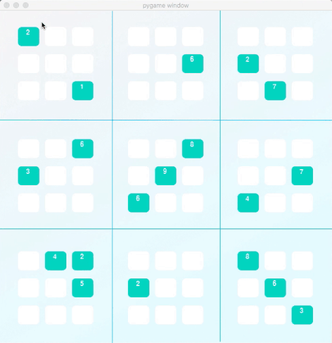

# Sudoku Solver



In this project, I built a Sudoku solving agent. It can solve any Sudoku puzzle including diagonal boards.  I implemented Depth First Search to traverse the tree of possibilities and called on several different strategies during this process. These strategies consisted of **only_choice()**, **eliminate()** and **naked_twins()**.

### code
------
This project requires python 3.  I personally use Anaconda, so I have provided a **aind-universal.yml** file at the root of the project to create an environment with all of the required dependencies.

```bash
bash$ conda env create -f aind-universal.yml
```
OSX & Linux
```bash
bash$ source activate aind
```
Windows
```bash
bash$ run activate aind
```
To run the application
```bash
(aind) bash$ python solution.py 
```
To run the applications unit tests
```bash
(aind) bash$ python -m unittest -v
```

### Naming Conventions
+ The rows will be labelled by the letters A, B, C, D, E, F, G, H, I.
+ The columns will be labelled by the numbers 1, 2, 3, 4, 5, 6, 7, 8, 9.
+ The individual squares at the intersection of rows and columns will be called boxes. These boxes will have labels 'A1', 'A2', ..., 'I9'.
+ The complete rows, columns, and 3x3 squares, will be called units. Thus, each unit is a set of 9 boxes, and there are 27 units in total.
+ For a particular box (such as 'A1'), its peers will be all other boxes that belong to a common unit (namely, those that belong to the same row, column, or 3x3 square).


### only_choice()
------
The only choice strategy says that if only one box in a unit allows a certain digit, then that box must be assigned that digit.

```python
for unit in unitlist:
    for digit in '123456789':
        dplaces = [box for box in unit if digit in values[box]]
        if len(dplaces) == 1:
            values[dplaces[0]] = digit
            
return values
```

### eliminate()
------
The eliminate strategy says that if a box has a value assigned, then none of the peers of that box can have the same value.

```python
solved_values = [box for box in values.keys() if len(values[box]) == 1]
for box in solved_values:
    digit = values[box]
    for peer in peers[box]:
        values[peer] = values[peer].replace(digit,'')
        
return values
```

### naked_twins()
------
This was the most complicated strategy to implement. Let's say a set of twins exist in a column, meaning that after several steps of reducing the puzzle, you are left with the numbers 2 and 3 in two separate boxes in the same column. Now, we don't know which one has a 2 and which one has a 3, but we know one thing for sure — the values 2 and 3 are locked in those two boxes, so no other box in their same unit (that specific column) can contain the values 2 or 3. Thus, I would go over all the boxes in that column, and remove the values 2 and 3 from their possible values.

```python
# Find all twin boxes - boxes with len() of 2
twin_boxes = [box for box in values.keys() if len(values[box]) == 2]

for twin_box in twin_boxes:
    twin_box_matches = []
    # Find Box units for each twin box - row, col, 3x3
    twin_box_units = [p for p in units[twin_box]]
    
    for box_unit in twin_box_units:
        for box in box_unit:
            # If theres a match, then its a naked twin
            if values[twin_box] == values[box] and twin_box != box:
                # Since its a naked twin, append the current unit (row, col or 3x3)
                if box_unit not in twin_box_matches:
                    twin_box_matches.append(box_unit)
    
    if len(twin_box_matches) > 0:
        # For every unit in twin_box_matches
        for box_max in twin_box_matches:
            for box in box_max:
                for c in values[twin_box]:
                    # If letter match
                    if c in values[box] and values[twin_box] != values[box] and len(values[box]) >= 2:
                        values[box] = values[box].replace(c, '')

return values
```

